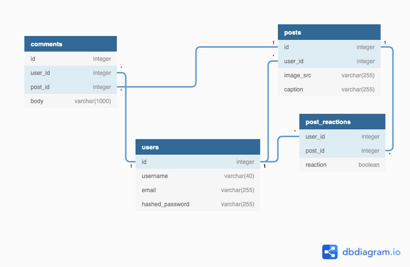

# Like-Or-Hate
[](https://like-or-hate.herokuapp.com/)
***Click on image for live link :^)***

Like-Or-Hate is an Instagram clone created by Benjamin Ash, Ananya Hans, Nathan Mount, and Christian Pettet.

All users can browse a selection of user posts, comment on posts, and up/downvote posts. In Like-Or-Hate, voting has consequences, and if more users hate a post than like it, the post will be deleted!

Any user can create a post, and upload any image to the website which will in-turn be hosted on an AWS (Amazon Web Services) S3 (Simple Storage Solution) bucket to offload server load.

## Database Diagram


## Technologies and Packages Used
### Backend
* Amazon Web Services (AWS) Simple Storage Solution (S3)
* Python
* Flask
* WTForms
* SQLAlchemy
* Alembic
* PostgreSQL
* Heroku

### Frontend
* HTML5
* CSS3
* JavaScript
* React
* Redux

## Current Features
### Posts
* Any registered user can view all posts by the website's users.
* AWS S3 is used to handle image hosting to reduce website load.
* Registered users can upload an image and attach a caption to their post.
* Post authors can edit their image's captions or delete their post.
### Comments
* Registered users can view all comments for a post.
* Registered users can comment on any post.
* Comment authors can edit or delete their comments.
### Post Reactions
* Registered users can like or hate a post. If there are more hates than likes, the post is democratically deleted!

## Challenges
### Personnel Shortage
Shortly after feature completion, the development team for Like-Or-Hate was torn by deferral and successfully landing a development position. The members who finished and polished Like-Or-Hate did so without their lost partners' inputs and worked on a codebase that was less than ideally created.
### Implementing Likes and Hates
Initially, likes and hates were tracked through an extension of the user model with a voted boolean for each post. An easier solution was found by creating a Post Reactions table to track each users' post reactions. The logic for finding if a user had reacted to a post was easier, and the solution to find the number of likes and hates with a SQL query was elegant and efficient.
```python
try:
   post_reaction = PostReaction.query.filter_by(post_id=post_id,user_id=current_user.id,).one()
except:
   post_reaction = PostReaction(user_id=current_user.id, post_id=post_id,
reaction=reaction)
   db.session.add(post_reaction)
   db.session.commit()

if str(post_reaction.reaction) != reaction:
   post_reaction.reaction = reaction
   db.session.commit()

count_likes = PostReaction.query.filter_by(post_id=post_id, reaction=True).count()
count_hates = PostReaction.query.filter_by(post_id=post_id, reaction=False).count()
```

## Future Features
* Implement comment reactions with democratic deletion.
* Implement web sockets to chat with other users.
* Implement a follows and tags feature to personalize a user's feed.
* Personalized views for posts based on user and post locations.

## Getting started

1. Clone this repository (only this branch)

   ```bash
   git clone https://github.com/composerben/flask-group-project.git
   ```

2. Install dependencies

      ```bash
      pipenv install --dev -r dev-requirements.txt && pipenv install -r requirements.txt
      ```

3. Create a **.env** file based on the **.env.example** with proper settings for your
   development environment
4. Setup your PostgreSQL user, password and database and make sure it matches your **.env** file

5. Activate your pipenv, migrate your database, seed your database, and run the Flask/backend app. After starting the backend server, keep the terminal running in the background.

   ```bash
   pipenv shell
   flask db upgrade
   flask seed all
   flask run
   ```

6. To run the React App in development, start a new terminal instance, navigate to the correct directory, install all dependencies, and start react.
```bash
cd react-app/
npm install
npm start
```

***
*IMPORTANT!*
   If you add any python dependencies to your pipfiles, you'll need to regenerate your requirements.txt before deployment.
   You can do this by running:

   ```bash
   pipenv lock -r > requirements.txt
   ```

*ALSO IMPORTANT!*
   psycopg2-binary MUST remain a dev dependency because you can't install it on apline-linux.
   There is a layer in the Dockerfile that will install psycopg2 (not binary) for us.
***

## Deploying to Heroku

1. Create a new project on Heroku
2. Under Resources click "Find more add-ons" and add the add on called "Heroku Postgres"
3. Run

   ```bash
   heroku login
   ```

4. Login to the heroku container registry

   ```bash
   heroku container:login
   ```

5. Update the `REACT_APP_BASE_URL` variable in the Dockerfile.
   This should be the full URL of your Heroku app: i.e. "https://flask-react-app.herokuapp.com"
6. [NON-M1 USERS] If not using an M1 Mac, continue with this step otherwise, skip ahead to the next step. Push your docker container to heroku from the root directory of your project.
   This will build the dockerfile and push the image to your heroku container registry

   ```bash
   heroku container:push web -a {NAME_OF_HEROKU_APP}
   ```
6. [M1 USERS] If using an M1 Mac, continue with this step, otherwise, skip to the next step. Build image with linux platform for heroku servers. Tag your app with the url for your apps registry. Use docker to push the image to the Heroku container registry.
```bash
docker buildx build --platform linux/amd64 -t {NAME_OF_HEROKU_APP} .
docker tag {NAME_OF_HEROKU_APP} registry.heroku.com/{NAME_OF_HEROKU_APP}/web
docker push registry.heroku.com/{NAME_OF_HEROKU_APP}/web
```

7. Release your docker container to heroku

   ```bash
   heroku container:release web -a {NAME_OF_HEROKU_APP}
   ```

8. set up your database:

   ```bash
   heroku run -a {NAME_OF_HEROKU_APP} flask db upgrade
   heroku run -a {NAME_OF_HEROKU_APP} flask seed all
   ```

9. Under Settings find "Config Vars" and add any additional/secret .env variables.
